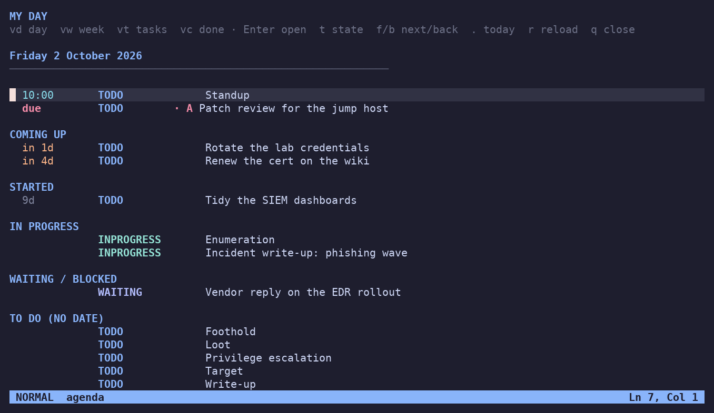
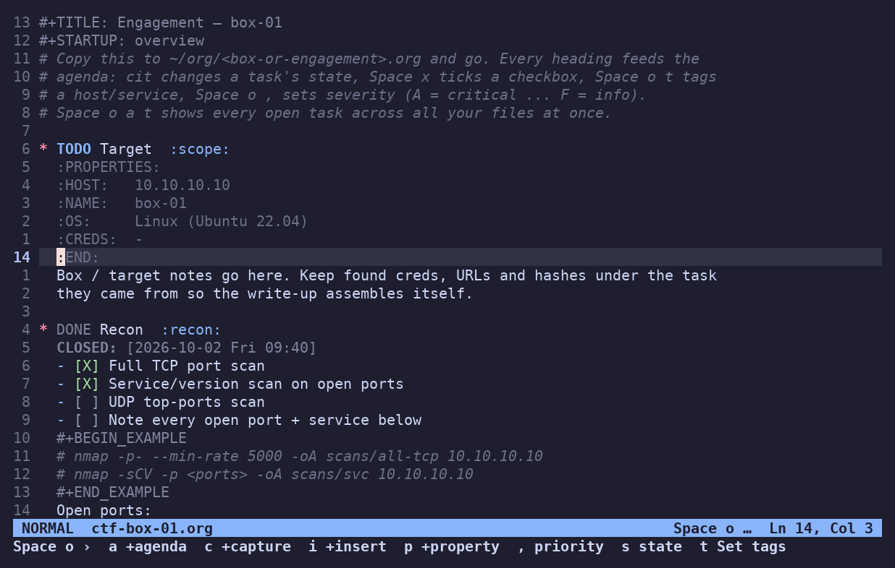
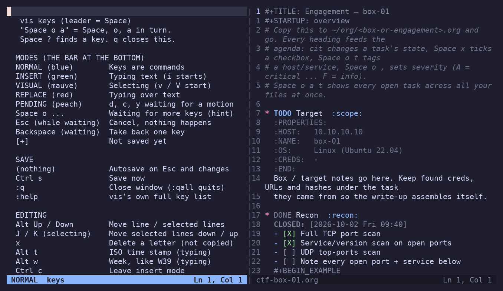

# vis kit

My daily-driver editor setup, rebuilt for [vis](https://github.com/martanne/vis)
in 124 KB: an org-mode agenda for the day, notes in plain text files, and a
cheat sheet that finds any key. It goes onto any Linux box in one line and
leaves nothing behind when you delete it.

<p align="center">
  
</p>

## Why

Hopping onto a new machine always meant losing my keybinds and the
quality-of-life pieces I'd built up on my own computers. On a locked-down host
I'd fall back to plain `vim` or `nano` and just live without them.

I kept running into vis on servers at work and was surprised a 440 KB binary
could do that much, next to Vim or Neovim once the plugins pile on. So I set
out to see how much of my real setup, [Normal Mode](https://github.com/jeffctl/normal-mode)
(Neovim with an org-mode agenda and a `Space ?` cheat sheet), would fit in an
ultra-light config. Nearly all of it did: 124 KB of Lua, no plugins, no
compiled parts, against the Neovim kit's ~100 MB.

It is not something I use every day. It is the thing that is there when I
need it: a CTF box, a server I can't install anything on, my phone.

## What it is, and isn't

It is a text-editor configuration: key bindings, a color theme, syntax
highlighting for org files, and a small Lua layer that reads `.org` files and
turns them into an agenda. Nothing in it runs anything on a target; it edits
text.

The `engagement.org` template is a checklist for capture-the-flag events
(Hack The Box, Huntress) and authorized penetration tests: recon, enumeration,
foothold, privilege escalation, loot, write-up. It keeps the notes and the
to-do list in one file so the write-up assembles itself as you work. That is
all it does.

Normal Mode is the Windows / Mac version of the same idea, which I also use to
bring new SOC analysts from GUI tools to the terminal. This is its Linux
companion: same keys, same files, so what someone learns on one carries to the
other.

<p align="center">
  
</p>

## Pick your situation

| I'm on… | Do this |
|---|---|
| **my own machine**, keeping it | [1. The full setup](#1-my-own-machine-the-full-setup) |
| **a CTF or temp box**, want it now | [2. One line](#2-a-ctf-or-temp-box-one-line) |
| **a locked-down work box** (RHEL, no root, no repos) | [3. Static binary](#3-a-locked-down-work-box-no-root-no-package-manager) |
| **my phone** (iSH / Termux) | [4. Phone](#4-phone-ish--termux) |
| just **trying it**, without touching `~/.config` | [5. Try it](#5-try-it-without-installing-anything) |

Needs vis 0.9 or newer, built with Lua and LPeg (every package below is).
Tested green on the 0.9 release and on current master, 93 checks each.

### 1. My own machine: the full setup

```sh
git clone https://github.com/jeffctl/vis-kit ~/.config/vis && ~/.config/vis/install.sh
```

`install.sh` installs vis if it is missing (apt, dnf, apk, pkg or brew),
backs up anything already at `~/.config/vis`, places the config and verifies
it. From a dotfiles checkout, `./install.sh --link` symlinks instead.

Then `vis` opens your day and `vis notes.org` opens a file. Org files live in
`~/org` (created on first run; on a Mac with beorg's iCloud folder, that folder
is used; override with `ORG_DIR=/some/path`).

### 2. A CTF or temp box: one line

```sh
curl -fsSL https://raw.githubusercontent.com/jeffctl/vis-kit/main/install.sh | sh
```

That fetches the kit, installs vis through whatever package manager the box
has (as root it skips `sudo`; a bare box without `sudo` is fine), places the
config and prints `PASS`. On Kali, Parrot or Ubuntu that is `apt`, whose `vis`
already includes `vis-menu` and `vis-clipboard`, so every key works. No curl?
`wget -qO- … | sh`, or `git clone` it and run `./install.sh`.

Start a box:

```sh
cp ~/.config/vis/templates/engagement.org ~/org/htb-boxname.org && vis ~/org/htb-boxname.org
```

`cit` moves a task through TODO / INPROGRESS / DONE, `Space x` ticks a step,
`Space o t` tags a host or service, `Space o ,` sets severity (A critical … F
info). `Space o a t` lists every open task across all your boxes at once.

Leaving: pull your notes off first, then remove the three folders and the
package.

```sh
scp ~/org/*.org you@yourbox:ctf/
rm -rf ~/.config/vis ~/.cache/vis-kit ~/org
sudo apt remove -y vis
```

### 3. A locked-down work box: no root, no package manager

vis builds itself into one statically linked file with the Lua runtime packed
inside. On a machine of yours with Docker and network:

```sh
git clone https://github.com/martanne/vis && cd vis && make docker   # -> ./vis, static, ~1–2 MB
```

Copy that `vis` and this folder to the box (scp, a share, a USB stick), then:

```sh
VIS_PATH=/path/to/vis-kit /path/to/vis
```

No root, nothing installed system-wide, no repos touched; delete the two and
the box is as it was. This is the path for RHEL, Rocky and Alma, where `vis`
is not in the base repos, and for anything air-gapped. Where you *can*
install: Fedora has `dnf install vis`; the RHEL family takes
`dnf copr enable madchem/vis-editor && dnf install vis`.

If file transfer is blocked too but you have a terminal, the kit is eleven
text files: paste them.

### 4. Phone: iSH / Termux

```sh
apk add vis      # iSH (Alpine)
pkg install vis  # Termux
git clone https://github.com/jeffctl/vis-kit ~/.config/vis
```

Quick on iSH, where Neovim crawls; the notes are the same files as on the
Mac if `~/org` is synced.

### 5. Try it without installing anything

```sh
git clone https://github.com/jeffctl/vis-kit && VIS_PATH=$PWD/vis-kit vis
```

`VIS_PATH` makes vis read this folder instead of `~/.config/vis`. Delete the
folder and it is gone.

## Keys

`Space ?` is the one to learn first: a fuzzy list of every key in plain
English. `Space K` keeps the same list open at the side. `:help` is vis's own
full reference.

<p align="center">
  
</p>

Space is the leader and never times out: after `Space` a hint shows what can
come next, `Backspace` steps back, `Esc` cancels, and nothing leaks into the
file. The bar at the bottom names the mode in words on a color (NORMAL blue,
INSERT green, VISUAL mauve), because that is the thing people coming from a
GUI editor get bitten by.

| | |
|---|---|
| `Space o a d` | your day (`a` the week, `t` every open task, `c` what you finished) |
| `Space o c t` | capture a task into the inbox (`s` with a start date, `d` with a due date, `n` a note) |
| `cit` | change a task's state (TODO, INPROGRESS, WAITING, BLOCKED, DONE, …) |
| `Space o i s` / `Space o i d` | give the task a start date / a deadline (`+3`, `fri`, `2026-10-05`) |
| `Space o ,` / `Space o t` | priority (A top, F low) / tags |
| `Space x` | tick a checkbox (a plain item gets one) |
| `Space ff` / `Space fo` / `Space fb` | find a file / an org file / switch window |
| `Alt↑` / `Alt↓` | move a line, or the selected lines (`J` / `K` in visual) |
| `Tab` / `Shift-Tab` | next / previous heading in an org file |
| `<<` / `>>` | promote / demote a heading |
| `Space sv` / `Space sh` / `Space sx` | split right / down / close |
| `Alt t` / `Alt w` (typing) | ISO time stamp / ISO week |
| `:qall` | leave |

In the agenda: `Enter` opens the task in a split, `t` changes its state,
`f` / `b` move a day or week, `.` back to today, `vd` / `vw` / `vt` / `vc`
switch views, `r` refresh, `q` close.

Files save themselves: the moment you leave insert mode, and after any change
in normal mode. `Ctrl-s` forces a save. Undo (`u` / `Ctrl-r`) survives saves.

## How it's built

Plain Lua on vis's own Lua API, no plugins, about 2,300 lines. The pieces I
think are worth a look:

- **The leader engine** (`kit/leader.lua`). vis hands a mapped key the rest of
  the typed input and asks how many bytes it consumed; returning "not enough
  yet" makes vis wait. The whole Space tree, the next-key hints, the inline
  prompts (type a date, pick a state) and the no-timeout behaviour are built
  on that one contract, re-walking the tree from the first key each time.
- **The org layer** (`kit/org.lua`, `kit/agenda.lua`). States with `CLOSED`
  and `:START:` stamps, `SCHEDULED` / `DEADLINE` planning lines, drawers,
  priorities, tags, checkboxes, captures, repeaters, all as line matching on a
  table of strings. The agenda's rules mirror Emacs and the Neovim kit:
  SCHEDULED is a start date and never a due date, deadlines warn ahead, a task
  has one row on today. It reads and writes the same files beorg, Emacs and
  Neovim's orgmode use, with LF line endings, so all of them interoperate.
- **Highlighting** is two small LPeg lexers (org files, the agenda view) and a
  Catppuccin Mocha theme with the states colored the way the Neovim kit does.
- **Testing.** A headless harness forks vis in a pseudo-terminal, types real
  keystrokes, reads the screen through a terminal emulator and checks the
  files on disk. 93 checks (hints, state changes, dates, captures, autosave,
  line moves, the agenda views, the pickers), green on vis 0.9 and on master.
  Most of the bugs it caught were in exactly the places you'd expect: byte
  counting for the space key, saving while a visual selection is active (vis
  would write only the selection), and vis 0.9's `pipe` not taking a string.

| file | what it does |
|---|---|
| `visrc.lua` | wires it together: the key trees, options, autosave, startup |
| `kit/leader.lua` | Space as leader with hints and inline prompts |
| `kit/org.lua` | the org file format in Lua |
| `kit/agenda.lua` | the day / week / tasks / done views |
| `kit/cheat.lua` | the `Space ?` finder and `Space K` panel, built from the key trees |
| `kit/mode.lua` | the mode bar |
| `kit/util.lua` | small shared helpers |
| `themes/catppuccin-mocha.lua` | the colors |
| `lexers/org.lua`, `lexers/orgagenda.lua` | highlighting |
| `templates/engagement.org` | the CTF / pentest skeleton |
| `install.sh` | the installer, also the `curl \| sh` bootstrap |

## Caveats

- **No native Windows.** vis needs POSIX: WSL or Cygwin on a Windows box. For
  a native-Windows machine, Normal Mode is the tool.
- **The pickers need `vis-menu`.** It ships with vis and every package has it;
  without it `Space ?` opens the side panel and the file pickers say so.
- **24-bit color** for the exact palette (Ghostty, iTerm2, kitty, WezTerm,
  Windows Terminal, Termux, Apple Terminal on macOS 26+). A 256-color terminal
  gets the nearest shades; the keys work regardless.
- **No folding.** vis has none, so drawers and subtrees stay open; `Tab` and
  `Shift-Tab` jump between headings instead.
- The agenda is a reimplementation of the date rules, not a port. Spot-check
  it against your own files before trusting it with anything that bites if
  it's wrong.

## Credits

[vis](https://github.com/martanne/vis) is Marc André Tanner's editor, and the
reason this is possible: a clean Lua API on a 440 KB binary. The palette is
[Catppuccin](https://github.com/catppuccin/catppuccin) Mocha. The lexers
build on [Scintillua](https://github.com/orbitalquark/scintillua)'s LPeg
lexer framework, which vis ships. I built the kit with Claude Code as a pair
programmer, working from the vis source and my Neovim setup, then tested it
headless against both vis versions.

## License

MIT. The bundled lexer framework license is in `lexers/LICENSE`.
